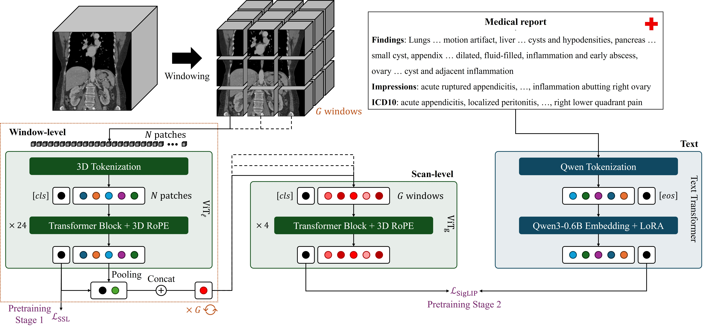

📢 [2026-07-17] SPECTRE now ships a command-line tool: point `spectre embed` at a `.nii`/`.nii.gz` file or a folder of them to get embeddings without writing any Python. Check below for details and usage examples.

📢 [2026-05-20] The pretrained SPECTRE model can now be loaded directly through the `transformers` library, no separate SPECTRE package installation required. Check below for details and usage examples.

📢 [2026-04-10] SPECTRE is now an official baseline for the [**CVPR 2026 Workshop Competition: Foundation Models for General CT Image Diagnosis**](https://www.codabench.org/competitions/12650/)! See `experiments/cvpr26_fm_for_ct_diag_task_1` for scripts and additional details.  

📢 [2026-02-21] SPECTRE has been accepted for presentation at **CVPR 2026** (Denver, Colorado, USA)!  

📢 [2026-01-20] [Semantic segmentation](https://github.com/cviviers/nnUNet) code and configurations using the nnUNet framework are now released!  

# SPECTRE 👻👻👻

<p align="center">
  <a href="https://pypi.org/project/spectre-fm/"></a>
  <a href="https://pypi.org/project/spectre-fm/"></a>
  <a href="https://pypi.org/project/spectre-fm/"></a>
  <a href="https://github.com/cclaess/SPECTRE/blob/main/LICENSE"></a>
  <a href="https://huggingface.co/cclaess/SPECTRE-Large"></a>
  <a href="https://arxiv.org/abs/2511.17209"></a>
</p>

<p align="center">
   
</p>

SPECTRE (**S**elf-Supervised & Cross-Modal **P**r**e**training for **CT** **R**epresentation **E**xtraction) is a **Transformer-based foundation model for 3D Computed Tomography (CT) scans**, trained using **self-supervised learning** (SSL) and **cross-modal vision–language alignment** (VLA). It provides rich and generalizable representations from medical imaging data, which can be fine-tuned for downstream tasks such as segmentation, classification, and anomaly detection.  

SPECTRE has been trained on a large cohort of **open-source CT scans** of the **human abdomen and thorax**, as well as **paired radiology reports** and **Electronic Health Record data**, enabling it to capture representations that generalize across datasets and clinical settings.  

This repository provides pretrained SPECTRE models together with tools for fine-tuning and evaluation.

## 🧠 Pretrained Models

The pretrained SPECTRE model can easily be imported using the `transformers` library

```python
from transformers import AutoModel
model = AutoModel.from_pretrained('cclaess/SPECTRE-Large', trust_remote_code=True)
```

or by using the `spectre-fm` package as follows:

```python
from spectre import SpectreImageFeatureExtractor
model = SpectreImageFeatureExtractor.from_pretrained('spectre-large')
```

Run `spectre list-models` to see what is available. Pass `include_feature_combiner=False` for per-crop backbone features instead of one embedding per scan.

### 🖥️ From the command line

If you just want embeddings out of a CT scan and would rather not write Python:

```bash
pip install "spectre-fm[inference]"

spectre embed scan.nii.gz -o embeddings/          # one scan
spectre embed /data/scans/ -o embeddings/         # a whole folder
```

This handles everything internally with the defaults SPECTRE was pretrained on: HU windowing to [-1000, 1000], RAS orientation, and 128×128×64 crops at the scan's native voxel spacing. Each scan produces `<name>.npz` containing `cls` (one vector for the scan) and `patch_tokens` (one vector per crop, shaped to the crop grid), plus a `manifest.csv`. Useful flags: `--backbone-only`, `--device cuda`, `--spacing 0.5 0.5 1.0` to resample, and `--max-crops-per-forward` if you run out of memory. See `spectre embed --help`.

### 🐍 From Python

Hand the model a scan in Hounsfield Units and it does the windowing for you:

```python
import torch

# One scan: (C, H, W, D) or (H, W, D), in raw HU.
scan = torch.randn(1, 384, 384, 256) * 500 - 500

with torch.no_grad():
    features = model(scan)

print("Features shape:", features.shape)   # (T', F') -> a CLS token plus one token per crop
```

Scans of different sizes can be embedded together by passing a list. All crops from all scans go through the backbone in a single pass, and only the feature combiner is split back out per scan:

```python
scans = [scan_a, scan_b, scan_c]           # any sizes, all in HU

with torch.no_grad():
    features = model.extract(scans)        # -> list of (T', F') tensors
```

If you have already windowed the scans yourself, pass the crops and their grid instead, and they are used untouched:

```python
from spectre import window_scan

crops, grid_size = window_scan(scan)       # (N, C, 128, 128, 64), (n_h, n_w, n_d)

with torch.no_grad():
    features = model(crops, grid_size=grid_size)
```

> **Reading files:** `spectre.load_ct` / `spectre.load_and_window` read `.nii`/`.nii.gz` and need the `[inference]` extra. Everything above works with just `pip install spectre-fm`.

Alternatively, you can download the weights of the separate components through HuggingFace using the following links:

| Architecture              | Input Modality     | Pretraining Objective   | Model Weights                                                                                                               |
|---------------------------|--------------------|-------------------------|-----------------------------------------------------------------------------------------------------------------------------|
| SPECTRE-ViT-Local         | CT crops           | SSL                     | [Download](https://huggingface.co/cclaess/SPECTRE/resolve/main/spectre_backbone_vit_large_patch16_128_no_vla.pt?download=true)  |
| SPECTRE-ViT-Local         | CT crops           | SSL + VLA               | [Download](https://huggingface.co/cclaess/SPECTRE/resolve/main/spectre_backbone_vit_large_patch16_128.pt?download=true)         |
| SPECTRE-ViT-Global        | Embedded CT crops  | VLA                     | [Download](https://huggingface.co/cclaess/SPECTRE/resolve/main/spectre_combiner_feature_vit_large.pt?download=true)             |
| Qwen3-Embedding-0.6B LoRA | Text (radiology)   | VLA                     | [Download](https://huggingface.co/cclaess/SPECTRE/resolve/main/spectre_qwen3_embedding_0.6B_lora.pt?download=true)              |

## 🩻 Segmentation (nnUNet)

If you're looking for a nnUNet-based segmentation pipeline that uses SPECTRE as the backbone, see this [GitHub](https://github.com/cviviers/nnUNet).

## 📂 Repository Contents

This repository is organized as follows:

- 🚀 **`src/spectre/`** – Contains the core package, including:
  - Pretraining methods
  - Model architectures
  - Data handling and transformations

- 🛠️ **`src/spectre/configs/`** – Stores configuration files for different training settings.

- 🔬 **`experiments/`** – Includes Python scripts for running various pretraining and downstream experiments.

- 🐳 **`Dockerfile`** – Defines the environment for running a local version of SPECTRE inside a container.

## ⚙️ Setting Up the Environment

To get up and running with SPECTRE, install the base package with pip:

```bash
pip install spectre-fm
```

This installs only the runtime dependencies needed to load and run the pretrained models.

To read CT scans from `.nii`/`.nii.gz` files or use the `spectre` command-line tool, add the inference extra:

```bash
pip install "spectre-fm[inference]"
```

If you want to fine-tune or pretrain SPECTRE, install the matching extra:

```bash
pip install "spectre-fm[training]"
```

If you only need the evaluation stack, install:

```bash
pip install "spectre-fm[eval]"
```

If training on GDS-enabled systems is required, install the CUDA 12 specific extra:

```bash
pip install "spectre-fm[gds-cuda12]"  # with training stack: "spectre-fm[training,gds-cuda12]"
```

**Note that** `gds-cuda12` is only compatible with CUDA 12.x environments.

To install everything at once, use:

```bash
pip install "spectre-fm[all]"
```

or install the latest updates directly from GitHub:

```bash
pip install git+https://github.com/cclaess/SPECTRE.git
```

## 🐳 Building and Using Docker

To facilitate deployment and reproducibility, SPECTRE can be run using **Docker**. This allows you to set up a fully functional environment without manually installing dependencies using your own local copy of spectre.

### **Building the Docker Image**

First, ensure you have **Docker** installed. Then, clone and navigate to the repository to build the image:

```bash
git clone https://github.com/cclaess/SPECTRE
cd SPECTRE
docker build -t spectre-fm .
```

### **Running Experiments Inside Docker**

Once the image is built, you can start a container and execute scripts inside it. For example, to run a DINO pretraining experiment:

```bash
docker run --gpus all --rm -v "$(pwd):/mnt" spectre-fm python3 experiments/pretraining/pretrain_dino.py --config_file spectre/configs/dino_default.yaml --output_dir /mnt/outputs/pretraining/dino/
```

- `--gpus all` enables GPU acceleration if available.
- `--rm` removes the container after execution.
- `-v $(pwd):/mnt` mounts the current directory inside the container.

## ⚖️ License

- **Code: MIT** — see `LICENSE` (permissive; commercial use permitted).
- **Pretrained model weights: CC-BY-NC-SA** — non-commercial share-alike. The weights and any derivative models that include these weights are NOT cleared for commercial use. See `LICENSE_MODELS` for details and the precise license text.

> Note: the pretrained weights are subject to the original dataset licenses. Users intending to use SPECTRE in commercial settings should verify dataset and model licensing and obtain any required permissions.

## 📜 Citation

If you use SPECTRE in your research or wish to cite it, please use the following BibTeX entry of our [preprint](https://arxiv.org/abs/2511.17209):

```
@misc{claessens_scaling_2025,
  title = {Scaling {Self}-{Supervised} and {Cross}-{Modal} {Pretraining} for {Volumetric} {CT} {Transformers}},
  url = {http://arxiv.org/abs/2511.17209},
  doi = {10.48550/arXiv.2511.17209},
  author = {Claessens, Cris and Viviers, Christiaan and D'Amicantonio, Giacomo and Bondarev, Egor and Sommen, Fons van der},
  year={2025},
}
```

## 🤝 Acknowledgements

This project builds upon prior work in self-supervised learning, medical imaging, and transformer-based representation learning. We especially acknowledge [**MONAI**](https://project-monai.github.io/) for their awesome framework and the [**timm**](https://timm.fast.ai/) & [**lightly**](https://docs.lightly.ai/self-supervised-learning/) Python libraries for providing 2D PyTorch models (timm) and object-oriented self-supervised learning methods (lightly), from which we adapted parts of the code for 3D.

[](https://star-history.com/#cclaess/SPECTRE&Date)
